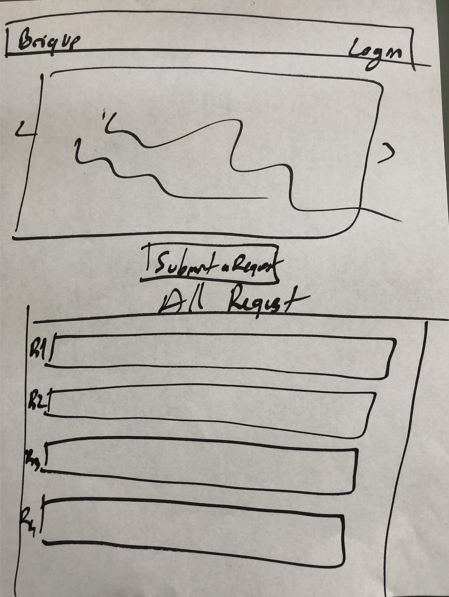
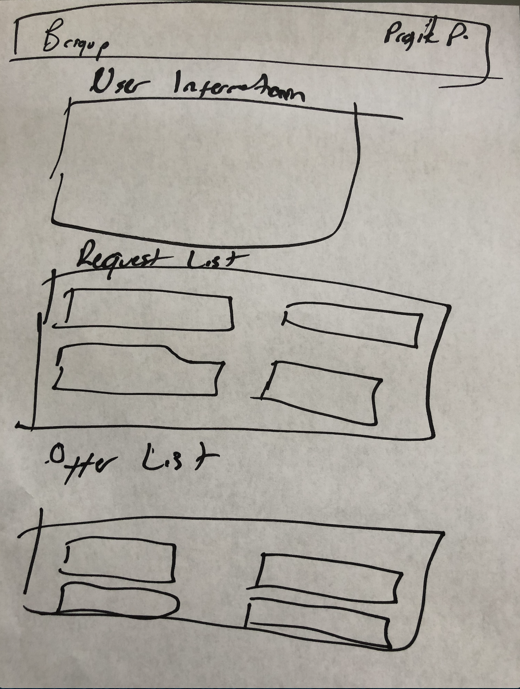
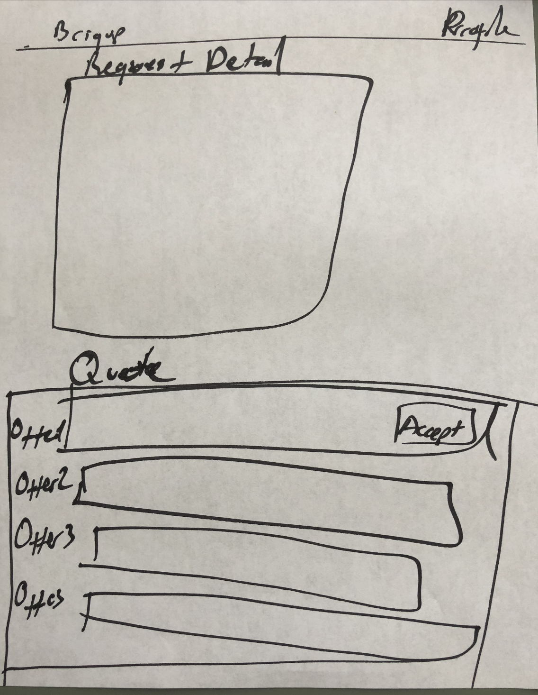

# Briqup

## Index:

- [Scope](#Scope)
- [User Stories](#user-stories)
- [Wireframes](#wireframes)
- [Data Models](#data-models)
- [Milestones](#milestones)

## Scope
Briqup is connecting construction owners with building material distributors. Users are able to create a request for quotation and suppliers are able to offer for these requests. An example model would be https://rfq.alibaba.com/rfq.html?spm=a2700.8293689.rfq.dbanner.6bf067afMzV77Y&tracelog=from_pc_home_banner. 

##### Technologies in play
- React
- Node.js
- Express
- MongoDB
- HTML 
- CSS 
- Heroku

## User Stories
- User Story 1: 
    - A user create a new requst. The user clicks on the “Submit RFQ” button on the home page. They are taken to a form which allows them to create a new request. They enter the location, dates, and detail of their request and then submit it. The page redirects the user to a page displaying their new request. 
- User Story 2: 
    - A user wants to give an offer for requests. They go to a list of all requests. They click on the request they want to offer. They are taken to a form which allows them to create new a quote with detail. When they submit, it will display inside of quotes for specific request.
- User Story 3: 
    - A user modifies their request. They click on their profile. They see a list of their requests. They click on a request and are redirected to the detail page for that request. They click on an edit button. They modify the request and then click submit. The new information is saved. They are redirected to the detail page for their request, which now displays the updated information. 

## Wireframe

## Data Models
- User
    - email
    - username
    - password
    - role (buyer or seller)
- Request
    - name
    - Destination
    - Category
    - Date
    - Detail
    - Associated to User
- Offer
    - price
    - detail
    - Associated Request
     - Associated to User

## Milestones

#### Sprint 1 
##### May 1
- Get the wireframe, user stories, data models and present the project to Michael and Brock for approval.
- Set up server and database, basic urls and templates. Set up the three models and front-end and back-end backbone
#### Sprint 2
##### May 4
- Finish backend for Homepage and Profile Page
- Create a component for Home Page
- Create a component for Profile Page
- Set up authentication and authorization
- Set up routes
#### Sprint 3
##### May 9
- Set up basic CRUD functionality for the request, be able to add, update and delete
- Create a component for a form for request
- Set up basic CRUD functionality for the quote, be able to add, update and delete
- Create a component for offer
- Display offers for quotes

#### Sprint 4
##### May 10
- Deploy to Heroku
- Bug Fixing
#### Bonus
##### May 11
- Set up basic a message center for users
- Send email notifications to users if their requests get any offer

